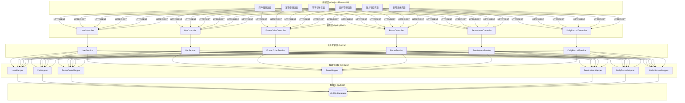
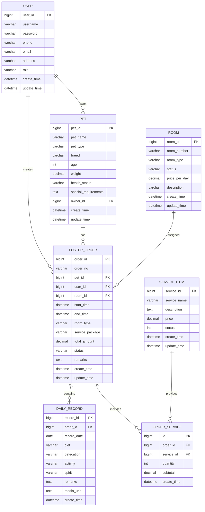

# 宠物寄养管理系统 - 项目设计文档

## 1. 系统架构

## 2. ER 图

## 3. 接口清单

### 3.1 UserController (`/api/user`)

| 方法   | 路径      | 描述                 |
| ------ | --------- | -------------------- |
| POST   | /login    | 用户登录             |
| POST   | /register | 用户注册             |
| GET    | /info     | 获取当前用户信息     |
| PUT    | /update   | 更新用户信息         |
| GET    | /list     | 获取用户列表(管理员) |
| DELETE | /{id}     | 删除用户(管理员)     |

### 3.2 PetController (`/api/pet`)

| 方法   | 路径    | 描述               |
| ------ | ------- | ------------------ |
| POST   | /add    | 添加宠物           |
| PUT    | /update | 更新宠物信息       |
| DELETE | /{id}   | 删除宠物           |
| GET    | /{id}   | 获取宠物详情       |
| GET    | /list   | 获取宠物列表       |
| GET    | /my     | 获取当前用户的宠物 |

### 3.3 FosterOrderController (`/api/order`)

| 方法   | 路径    | 描述             |
| ------ | ------- | ---------------- |
| POST   | /create | 创建寄养订单     |
| PUT    | /update | 更新订单信息     |
| PUT    | /status | 更新订单状态     |
| GET    | /{id}   | 获取订单详情     |
| GET    | /list   | 获取订单列表     |
| GET    | /my     | 获取当前用户订单 |
| DELETE | /{id}   | 取消订单         |

### 3.4 RoomController (`/api/room`)

| 方法   | 路径       | 描述         |
| ------ | ---------- | ------------ |
| POST   | /add       | 添加房间     |
| PUT    | /update    | 更新房间信息 |
| DELETE | /{id}      | 删除房间     |
| GET    | /{id}      | 获取房间详情 |
| GET    | /list      | 获取房间列表 |
| GET    | /available | 获取可用房间 |

### 3.5 ServiceItemController (`/api/service`)

| 方法   | 路径    | 描述         |
| ------ | ------- | ------------ |
| POST   | /add    | 添加服务项目 |
| PUT    | /update | 更新服务项目 |
| DELETE | /{id}   | 删除服务项目 |
| GET    | /{id}   | 获取服务详情 |
| GET    | /list   | 获取服务列表 |

### 3.6 DailyRecordController (`/api/record`)

| 方法   | 路径             | 描述               |
| ------ | ---------------- | ------------------ |
| POST   | /add             | 添加日常记录       |
| PUT    | /update          | 更新日常记录       |
| DELETE | /{id}            | 删除日常记录       |
| GET    | /{id}            | 获取记录详情       |
| GET    | /order/{orderId} | 获取订单的所有记录 |

## 4. UI/UX 规范

### 4.1 色彩规范

- 主色调: `#409EFF` (Element UI 默认蓝)
- 成功色: `#67C23A`
- 警告色: `#E6A23C`
- 危险色: `#F56C6C`
- 信息色: `#909399`
- 背景色: `#F5F7FA`
- 卡片背景: `#FFFFFF`

### 4.2 字体规范

- 主字体: `"Helvetica Neue", Helvetica, "PingFang SC", "Hiragino Sans GB", "Microsoft YaHei", Arial, sans-serif`
- 标题字号: 20px / 18px / 16px
- 正文字号: 14px
- 辅助文字: 12px

### 4.3 间距规范

- 页面边距: 20px
- 卡片内边距: 20px
- 元素间距: 16px
- 紧凑间距: 8px

### 4.4 圆角规范

- 卡片圆角: 8px
- 按钮圆角: 4px
- 输入框圆角: 4px

### 4.5 阴影规范

- 卡片阴影: `0 2px 12px 0 rgba(0, 0, 0, 0.1)`
- 悬浮阴影: `0 4px 16px 0 rgba(0, 0, 0, 0.15)`
